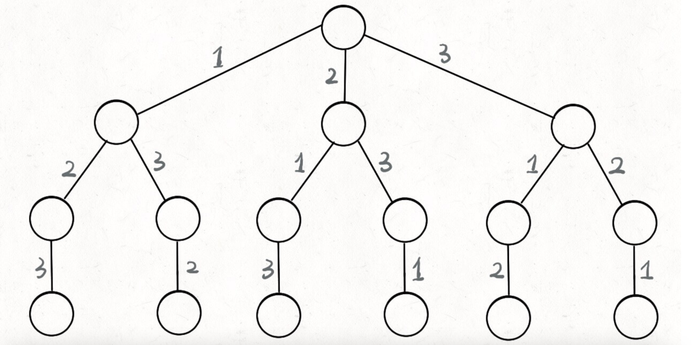

# 解题框架
解决一个回溯问题，实际上就是一个决策树的遍历过程。你只需要思考 3 个问题：
1、路径：也就是已经做出的选择。
2、选择列表：也就是你当前可以做的选择。
3、结束条件：也就是到达决策树底层，无法再做选择的条件。

代码方面，回溯算法的框架：
```java
result = []
def backtrack(路径, 选择列表):
if 满足结束条件:
result.add(路径)
return

    for 选择 in 选择列表:
        做选择
        backtrack(路径, 选择列表)
        撤销选择
```
其核心就是 for 循环里面的递归，在递归调用之前「做选择」，在递归调用之后「撤销选择」，特别简单。

# 算法题举例
### 全排列问题


```java
for 选择 in 选择列表:
    # 做选择
    将该选择从选择列表移除
    路径.add(选择)
    backtrack(路径, 选择列表)
    # 撤销选择
    路径.remove(选择)
    将该选择再加入选择列表
```
**这也是回溯算法的一个特点，不像动态规划存在重叠子问题可以优化，回溯算法就是纯暴力穷举，复杂度一般都很高**

**写 backtrack 函数时，需要维护走过的「路径」和当前可以做的「选择列表」，当触发「结束条件」时，将「路径」记入结果集**